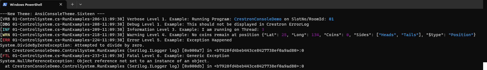

# Serilog.Sinks.CrestronConsole

A Serilog sink that writes log events to the Text Console of a Crestron 4-series Control Appliances and Crestron Control
Servers such as a CP4(N) or VC4. The default output is plain text; JSON formatting can be plugged in using a package
such as [_Serilog.Formatting.Compact_](https://github.com/serilog/serilog-formatting-compact).

This repository was built upon the efforts made by the folks behind
the [Serilog.Sinks.Console](https://github.com/serilog/serilog-sinks-console) repository.

It is our intention to maintain as much feature parity with the Serilog.Sinks.Console package where possible.

### Getting started

To use the Crestron console sink, first install the NuGet package:

```shell
dotnet add package Serilog.Crestron
```

Then enable the sink using `WriteTo.CrestronConsole()`:

```csharp
Log.Logger = new LoggerConfiguration()
    .WriteTo.CrestronConsole()
    .CreateLogger();

Log.Information("Hello world");
```

When connected via ssh or using toolbox text console tool, you'll see the output:

```
[12:50:51 INF] Hello, world!
```

### Themes

The sink will not colorize output by default as Crestron Toolbox doesn't support colorized output.

If colorized output is configured it will result in output like this:



Themes can be specified when configuring the sink:

```csharp
    .WriteTo.CrestronConsole(theme: AnsiConsoleTheme.Sixteen)
```

The following built-in themes are available:

* `ConsoleTheme.None` - no styling
* `AnsiConsoleTheme.Literate` - an ANSI 256-color version of the "literate" theme
* `AnsiConsoleTheme.Grayscale` - an ANSI 256-color version of the "grayscale" theme
* `AnsiConsoleTheme.Code` - an ANSI 256-color Visual Studio Code-inspired theme
* `AnsiConsoleTheme.Sixteen` - an ANSI 16-color theme that works well with both light and dark backgrounds

Adding a new theme is straightforward; examples can be found in [`AnsiConsoleThemes`](./Themes/AnsiConsoleThemes.cs)
classes.

### Output templates

The format of events to the console can be modified using the `outputTemplate` configuration parameter:

```csharp
    .WriteTo.CrestronConsole(
        outputTemplate: "[{Timestamp:HH:mm:ss} {Level:u3}] {Message:lj}{NewLine}{Exception}")
```

The default template, shown in the example above,
uses [built-in properties](https://github.com/serilog/serilog/wiki/Formatting-Output) properties like `Timestamp`
and `Level`. Properties from events, including those attached
using [enrichers](https://github.com/serilog/serilog/wiki/Enrichment), can also appear in the output template.

### JSON output

The sink can write JSON output instead of plain text. `CompactJsonFormatter` or `RenderedCompactJsonFormatter`
from [Serilog.Formatting.Compact](https://github.com/serilog/serilog-formatting-compact) is recommended:

```shell
dotnet add package Serilog.Formatting.Compact
```

Pass a formatter to the `CrestronConsole()` configuration method:

```csharp
    .WriteTo.CrestronConsole(new RenderedCompactJsonFormatter())
```

Output theming is not available when custom formatters are used.

### Performance

Console logging is synchronous and this can cause bottlenecks in some deployment scenarios. For high-volume console
logging, consider using [_Serilog.Sinks.Async_](https://github.com/serilog/serilog-sinks-async) to move console writes
to a background thread:

```csharp
// dotnet add package serilog.sinks.async

Log.Logger = new LoggerConfiguration()
    .WriteTo.Async(wt => wt.CrestronConsoleSink())
    .CreateLogger();
```

### Configuration Files

Logger configuration can easily be achieved by using Serilog Configuration packages:

* [Serilog.Settings.AppSettings](https://github.com/serilog/serilog-settings-appsettings) for XML Configurations
* [Serilog.Settings.Configuration](https://github.com/serilog/serilog-settings-configuration) for JSON Configurations

These packages were designed for regular .NET applications (Microsoft Console, WinForms, etc), so
a [couple of adjustments](../../../../assets/FileConfigurations.md) are needed to work under Crestron.

### Contributing

See [Contributing.md](../../../../CONTRIBUTING.md)

_Copyright &copy; All Contributers - Provided under
the [Apache License, Version 2.0](http://apache.org/licenses/LICENSE-2.0.html)._
